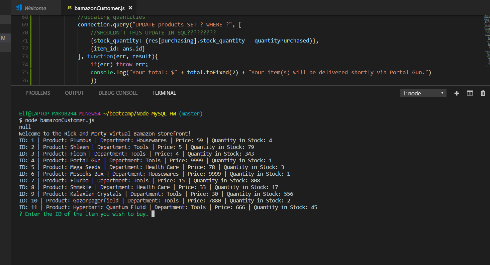
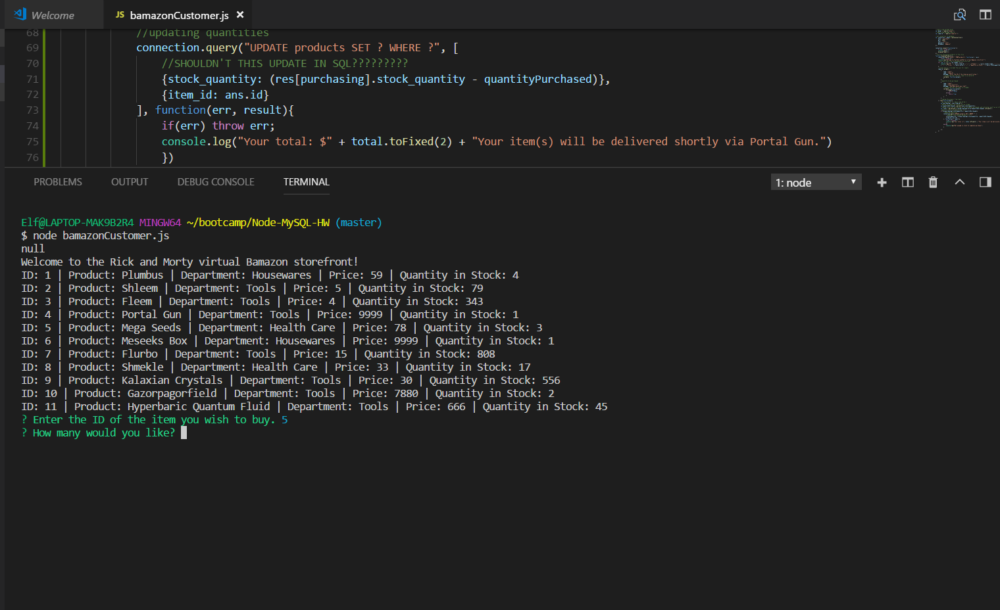
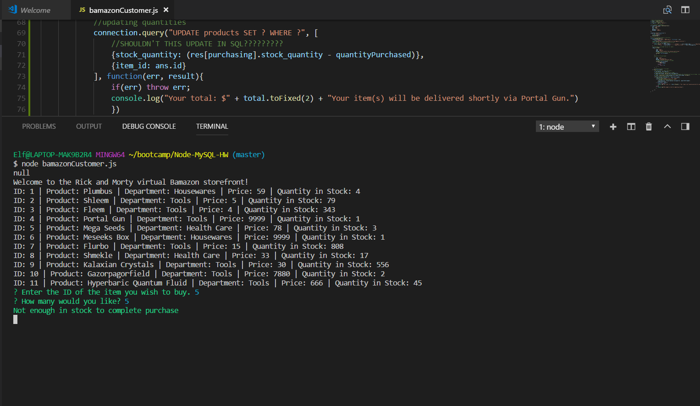
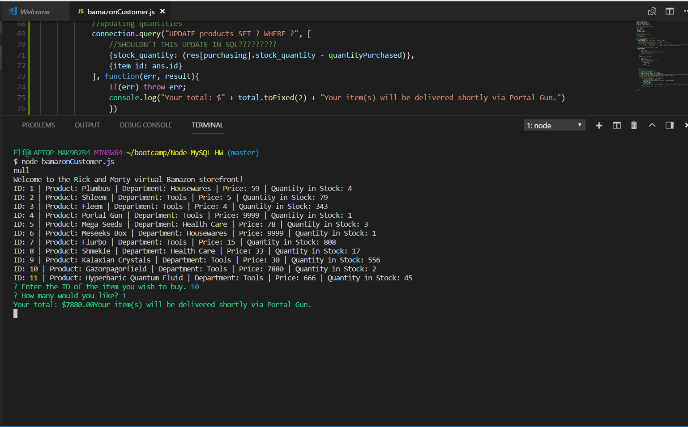
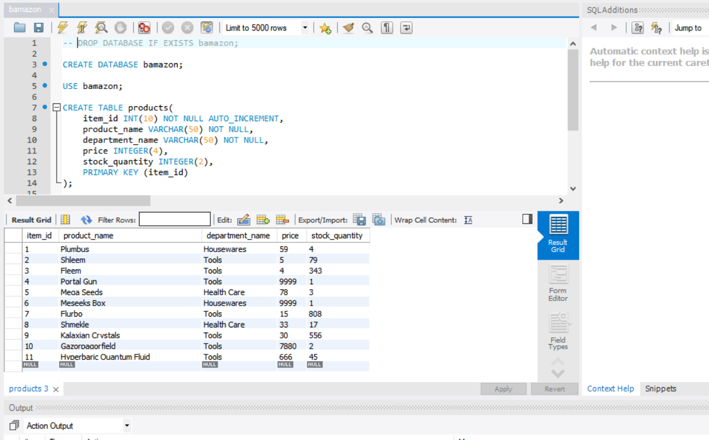

# Node-MySQL-HW
##Rick and Morty Themed Bamazon

    An attempt at a Node.js app using MySQL to display product information from a database in MySQL.  The database includes products with their id numbers, their department, price, and quantity in stock.

## Screenshots
    
    Prompt for initial purchase
     Quanitity prompt
     Demonstrating not enough stock to purchase
     Demonstrating enough stock to purchase

    
## Issues to still be ironed out

     MySQL doesn't update

    
## Dependencies
 
    Requires the use of NPM packages:
    Inquirer
    MySQL
